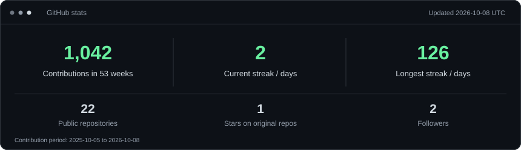
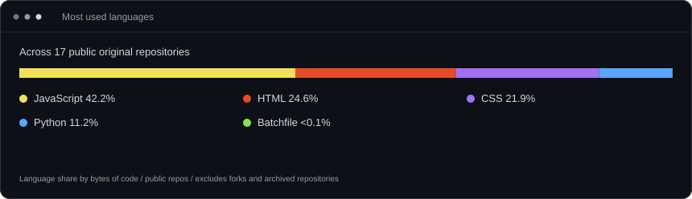

<h2>Hi, I'm Varshith</h2>

A Computer Science Engineering student exploring AI, building projects, and learning along the way.

 

<h3>My GitHub Activity</h3>

  

<h3>GitHub Stats</h3>

  

  

<h3>A Little About Me</h3>

<table>
  <tr>
    <td valign="top"></td>
    <td valign="top"></td>
  </tr>
</table>

 

<h3>Skills &amp; Technologies</h3>

  

<h3>My Contribution Arcade</h3>

A playful look at my GitHub activity, refreshed daily.

  

<h4>Contribution Snake</h4>

  

<h4>Pac-Man Meets My Contributions</h4>

  

<h3>Things I'm Building</h3>

| Project | What I'm building |
| :--- | :--- |
| **Raphael AI** | A customizable personal AI assistant; exploring voice interaction, computer control, and web interaction. In development. |
| [**Remote Laptop Control**](https://github.com/Varshith-eati/Remote_Laptop_Control) | Control my laptop from a mobile device. |
| [**Ping Pong X3000**](https://github.com/Varshith-eati/Ping-Pong-X3000) | A ping pong game with single-player and multiplayer modes. |

 

<h3>Let's Connect</h3>

<a href="https://github.com/Varshith-eati">GitHub</a> &nbsp; / &nbsp;
<a href="https://www.linkedin.com/in/varshith-eati-0080661b0/">LinkedIn</a> &nbsp; / &nbsp;
<a href="https://www.instagram.com/varshitheati/">Instagram</a>

  

<em>Learn. Build. Explore. Repeat.</em>

  

Beyond the Code

 

I started coding in 2024 with Python. I like drawing, gaming, and figuring out how new technology works. I'm still exploring where computer science will take me.

My anime watchlist includes Attack on Titan, Naruto, One Piece, Pokémon, KonoSuba, The Eminence in Shadow, and That Time I Got Reincarnated as a Slime.

 

Daily stats and contribution animations · <a href="./PROFILE-ART.md">How this profile works</a>

