<h3><code>varshith@github ~ $ ./contributions.sh</code></h3>

  

<h3><code>varshith@github ~ $ whoami</code></h3>

<table>
  <tr>
    <td valign="top"></td>
    <td valign="top"></td>
  </tr>
</table>

 

<h3><code>varshith@github ~ $ ls projects/</code></h3>

| Project | What I'm building |
| :--- | :--- |
| **Raphael AI** | A customizable personal AI assistant; exploring voice interaction, computer control, and web interaction. In development. |
| [**Remote Laptop Control**](https://github.com/Varshith-eati/Remote_Laptop_Control) | Control my laptop from a mobile device. |
| [**Ping Pong X3000**](https://github.com/Varshith-eati/Ping-Pong-X3000) | A ping pong game with single-player and multiplayer modes. |

 

<h3><code>varshith@github ~ $ cat links.txt</code></h3>

<a href="https://github.com/Varshith-eati">GitHub</a> &nbsp; / &nbsp;
<a href="https://www.linkedin.com/in/varshith-eati-0080661b0/">LinkedIn</a> &nbsp; / &nbsp;
<a href="https://www.instagram.com/varshitheati/">Instagram</a>

  

<code>Learn. Build. Explore. Repeat.</code>

  

More about me

 

I started coding in 2024 with Python. I like drawing, gaming, and figuring out how new technology works. I'm still exploring where computer science will take me.

My anime watchlist includes Attack on Titan, Naruto, One Piece, Pokémon, KonoSuba, The Eminence in Shadow, and That Time I Got Reincarnated as a Slime.

 

Self-contained SVGs · Daily contribution snapshot · <a href="./PROFILE-ART.md">How this profile works</a>

